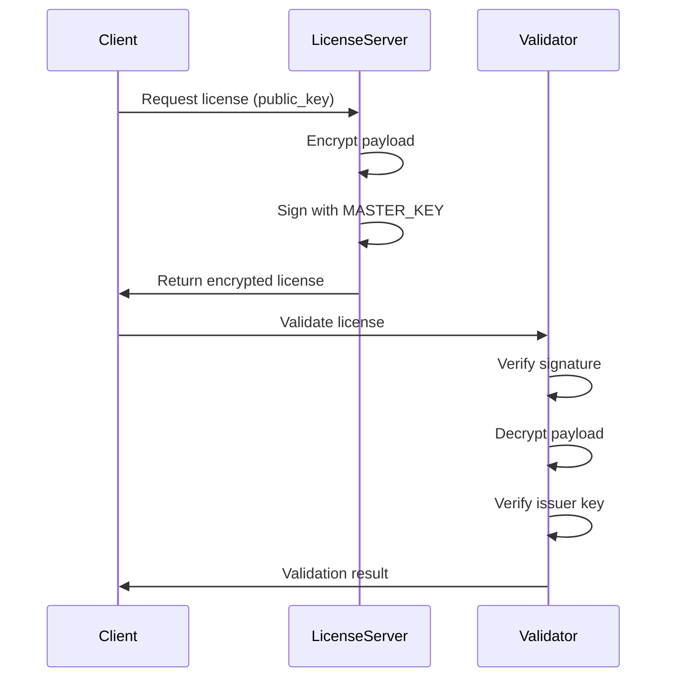

# Sigma-Permit, OpenSource Multi-Tenant License System

A secure, scalable license management system for software applications, featuring:
- Cryptographic license generation and verification
- Cross-environment deployment support
- Robust security against forgery and tampering
- Automated license renewal

## System Architecture

### Key Components
1. **License Server**  
   - Generates and signs licenses
   - REST API for license operations
   - Configurable with MASTER_KEY
   - Endpoints:
     - `/generate`: Create signing key pairs
     - `/issue`: Generate signed licenses
     - `/verify`: Validate licenses

2. **License Controller**  
   - Automated license renewal agent
   - Checks license expiration
   - Fetches new licenses from server
   - Updates license file
   - Configurable via environment variables

3. **License Validator**  
   - Embedded license verification
   - Cryptographic signature validation
   - License expiration checking
   - Hardcoded decryption key

### Security Features
- **Asymmetric Encryption**: RSA-2048 for license confidentiality
- **Ed25519 Signatures**: Cryptographic proof of license authenticity
- **Key Binding**: Prevents public key substitution attacks
- **Environment Isolation**: Secure key storage and configuration
- **Tamper Protection**: Encrypted payloads prevent modification

## Getting Started

### Prerequisites
- Python 3.8+
- Docker (for container deployments)
- OpenSSL (optional: for key generation)

### Installation
```bash
git clone https://github.com/tgkirupakaran/mei-paguppaaivu.git
cd mei-paguppaaivu/license-system
pip install -r requirements.txt
```

### Key Generation
1. Generate RSA key pair:
```bash
openssl genpkey -algorithm RSA -out private_key.pem -pkeyopt rsa_keygen_bits:2048
openssl rsa -pubout -in private_key.pem -out public_key.pem
```

2. Configure environment variables:
```bash
# License Server
export MASTER_KEY="$(cat private_key.pem)"
export MASTER_PUBLIC_KEY="$(cat public_key.pem)"

# Validator/Controller
export TRUSTED_PUBLIC_KEY="$(cat public_key.pem)"
export LICENSE_FILE_PATH="/path/to/license.json"
```

### Running Components
**License Server:**
```bash
cd license_server
uvicorn main:app --reload --port 8000
```

**License Controller:**
```bash
cd license_controller
python main.py
```

**License Validator (Embed in your application):**
```python
from license_validator.validator import validate

if validate():
    print("Valid license")
else:
    print("Invalid license")
```

## Deployment Scenarios

### Kubernetes
```yaml
# License Controller Deployment
apiVersion: apps/v1
kind: Deployment
spec:
  containers:
  - name: license-controller
    image: your-registry/license-controller
    env:
    - name: LICENSE_FILE_PATH
      value: "/etc/license/license.json"
    - name: FETCH_URL
      value: "http://license-server:8000/issue"
    volumeMounts:
    - name: license-volume
      mountPath: "/etc/license"
```

### Docker
```bash
# License Server
docker run -p 8000:8000 \
  -e MASTER_KEY="$(cat private_key.pem)" \
  -e MASTER_PUBLIC_KEY="$(cat public_key.pem)" \
  your-registry/license-server

# License Controller
docker run -d \
  -e LICENSE_FILE_PATH="/app/license.json" \
  -e FETCH_URL="http://license-server:8000/issue" \
  -v ./licenses:/app \
  your-registry/license-controller
```

### Cloud Platforms (AWS/Azure/GCP)
1. Store keys in cloud secret manager
2. Mount license storage volume
3. Configure environment variables via:
   - AWS Parameter Store
   - Azure App Configuration
   - GCP Secret Manager

## Best Practices
1. **Key Management**:
   - Use hardware security modules (HSMs) for production
   - Never commit keys to version control

2. **Deployment**:
   - Use HTTPS for all API communications
   - Implement rate limiting on issue endpoint

3. **Monitoring**:
   - Track license expiration dates
   - Monitor validation failures
   - Audit license issuance

## Security Model


## Support
For issues and feature requests, open an issue in our [GitHub repository](https://github.com/tgkirupakaran/mei-paguppaaivu).
